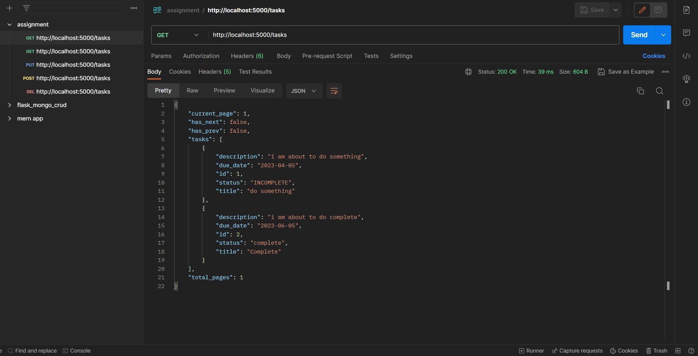

# Graydot Backend Assignment

## Setup and Run

### Install required packages

```bash
pip install pipenv
pipenv install
```

### Start the API

```bash
python ./main.py
```

## API specification

|             Task                  | Endpoint                      |
|             ---                   |              ---              |
| Create a new task.                | /tasks method: POST           |
| Retrieve a single task by its ID  | /tasks/<#> method: GET        |
| Update an existing task           | /tasks/<#> method: PUT        |
| Delete a task                     | /tasks/<#> method: DELETE     |
| List all tasks                    | /tasks?page=<#>?per_page=<#>  |

### Post body

```json
{
    "title": "do something",
    "description": "i am about to do something",
    "due_date": "5-4-2023"
}
```

### Put Body

```json
{
    "title": "Complete",
    "description": "i am about to do complete",
    "due_date": "5-4-2023",
    "status": "complete"
}
```

## Notes

- date to be passed must be a string in the format '%d-%m-%Y'

## Screenshot


